# PCInotes
集体智慧编程笔记

代码来自[原书官网](http://shop.oreilly.com/product/9780596529321.do)

思维导图来自[www.pythoner.com](http://www.pythoner.com/183.html)

## 第一章 集体智慧导言
略

## 第二章 推荐
- 思维导图

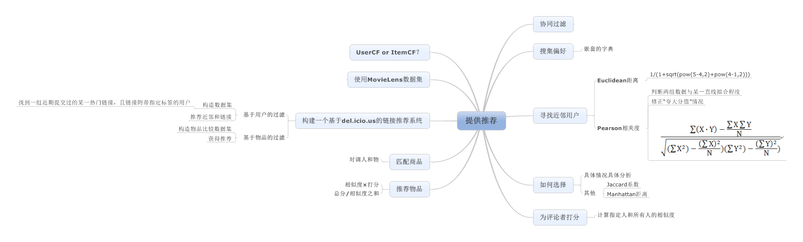

## 第三章 聚类
- 思维导图

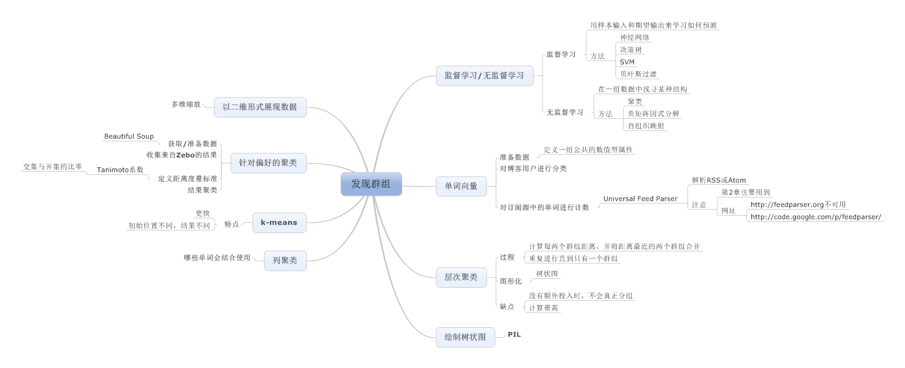

## 第四章 搜索与排名
- 思维导图

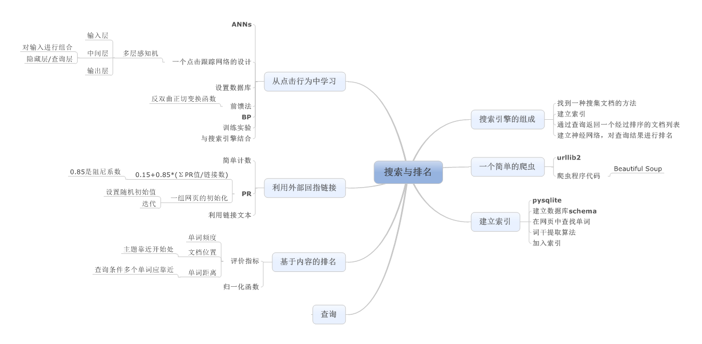

## 第五章 优化
- 思维导图

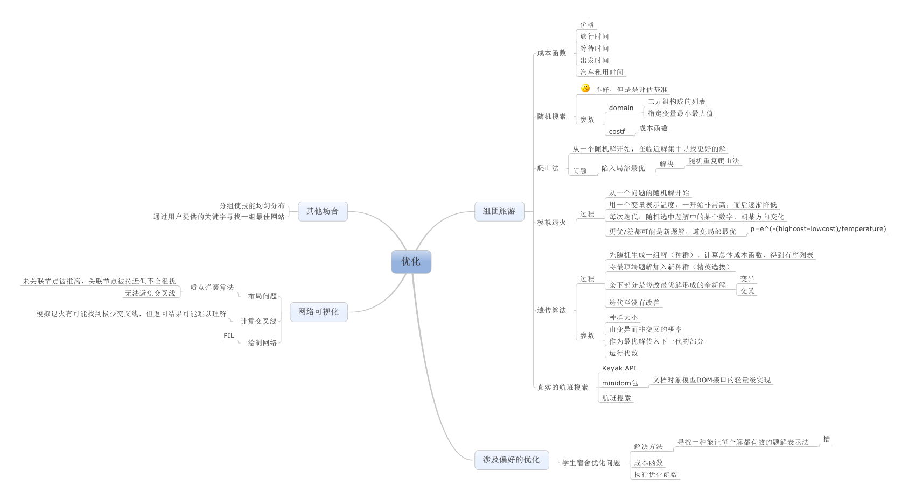

## 第六章 过滤
- 思维导图

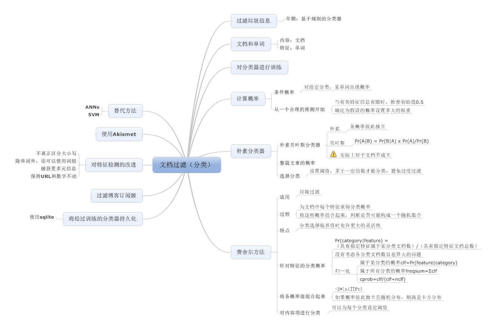

## 第七章 决策树
- 思维导图

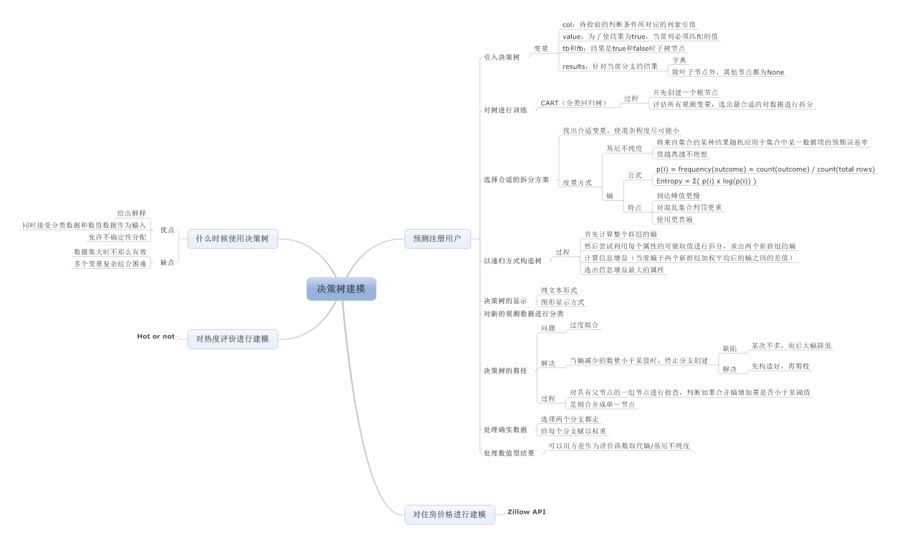

## 第八章 价格模型
- 思维导图

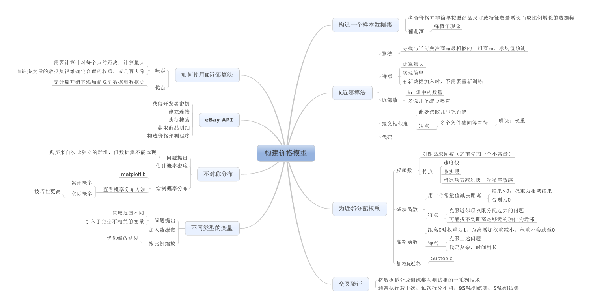

## 第九章 SVM
- 思维导图

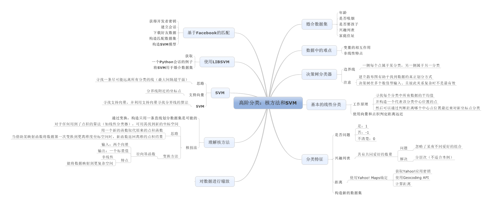

## 第十章 独立特征
- 思维导图

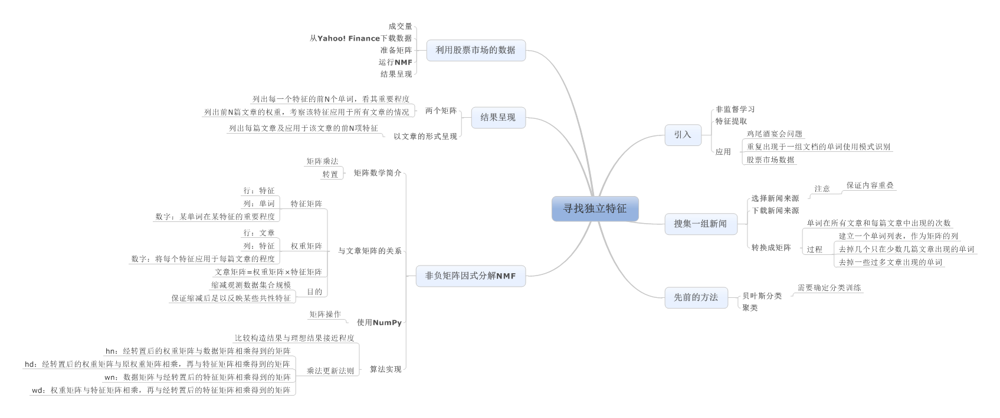

## 第十一章 智能进化
- 思维导图

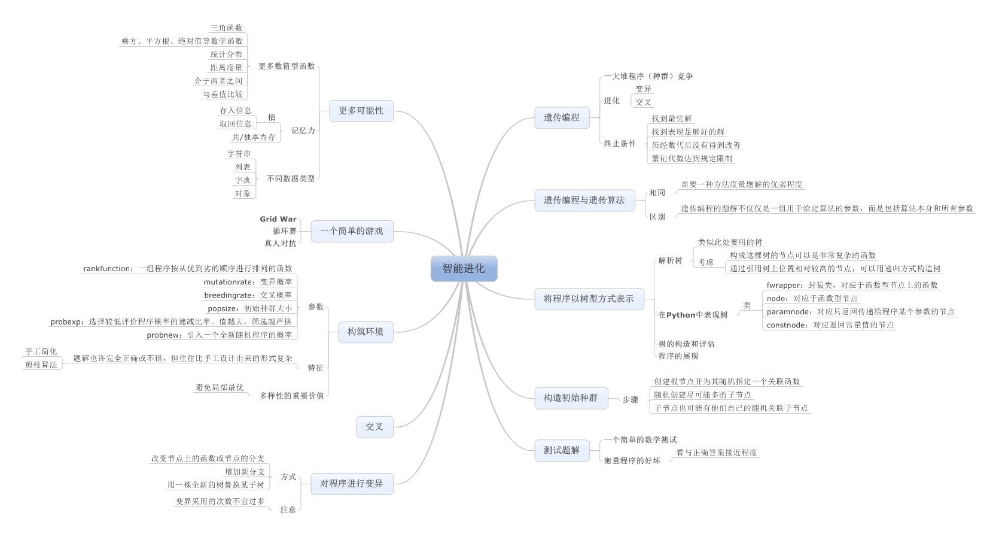

## 第十二章 算法总结
- 思维导图

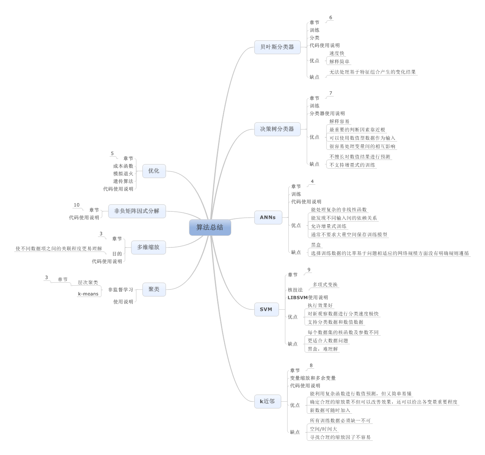

